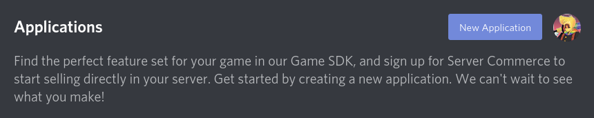
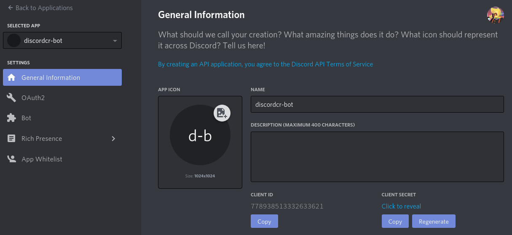
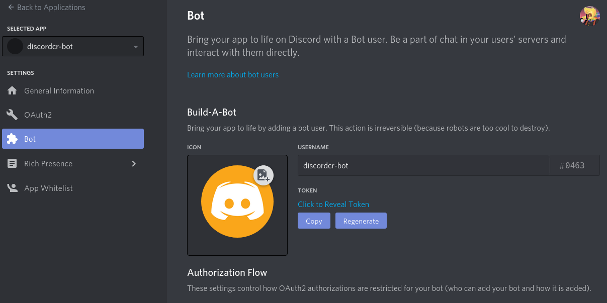

# Creating your Discord Application

It's time to create your first Discord application, which will act as your bot's account!
You can create up to 25 applications and each one can be used for both bots and oauth.
Creating an application is really easy:
- Head over to the [Developer Portal](https://discord.com/developers/applications).
- Click the **New Application** button.



- Fill in its name and click the **Create** button.
- You should now be looking at the following page. Feel free to add any info or images.



- From the sidebar, click on the **Bot** category and click on the **Add Bot** button.
- Look around the page and don't be afraid to play with the settings!



- That's all, your application is ready!

:::tip
Copy the `Client ID` from the **General Information** tab and the `Token` from the **Bot** tab in a safe place, you are going to need them later.
:::

:::danger
While `Client ID` is public information, `Token` isn't and should be treated with extra security. It's basically your bot's password.

If it gets leaked, go to your bot's application page and click the **Regenerate** button under the **Bot** tab ASAP!
:::

## Inviting your bot to your Guild

You need to create an invite URL that includes the permissions your bot requires.
A basic invite URL consists of 3 parts:

```
https://discord.com/oauth2/authorize?client_id=000000000000000000&scope=bot&permissions=0
```

- `client_id`: Your bot's client ID
- `scope`: The oauth [scope](https://discord.com/developers/docs/topics/oauth2#shared-resources-oauth2-scopes) you need, in this case, bot
- `permissions`: The [bitwise value](https://discord.com/developers/docs/topics/permissions#permissions-bitwise-permission-flags) of the permissions your application requires

Don't worry, you don't need to generate it yourself.
[Permission Calculator](https://discordapi.com/permissions.html) does it for you! Just input the required info and select the permissions you want!

:::tip
It's a good practice to require permissions individually rather than just `ADMINISTRATOR`, this way server admins get to choose wether or not they want your bot to have access to X permission.
:::
